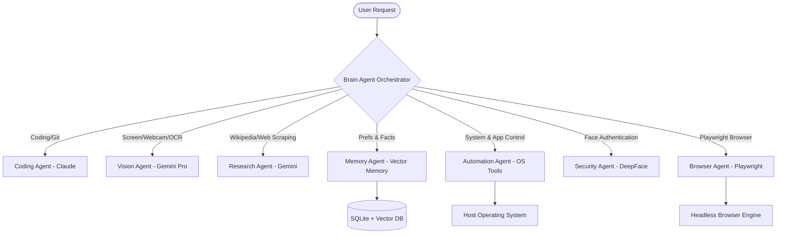

# J.A.R.V.I.S. AI OS (v3.0)
> **Production-Grade Multi-Agent AI Operating System**  
> *Designed and developed by Balu P.*

---

## 📌 Executive Summary

JARVIS AI OS v3.0 is a highly modular, multi-agent AI operating system that automates tasks across PC, browser, mobile, and system environments. Operating on a hybrid Multi-LLM architecture, JARVIS orchestrates specialized autonomous agents through an intelligent central Brain, enabling advanced capabilities in vision, local execution, system automation, long-term memory, and self-healing software development.

---

## 🛠️ Core Architecture



### 1. Central Orchestrator & Intelligent Router
- **Brain Agent (`core/agents/brain_agent.py`):** Acts as the central command classifier. It processes voice, API, or text inputs and dynamically delegates execution to the most suited specialized sub-agent.
- **Multi-LLM Router (`core/router/llm_router.py`):** Intelligently routes individual sub-tasks to different models depending on their strengths (Claude 3.5 Sonnet for software engineering, GPT-4o for complex system logic, Gemini 1.5 Pro for vision & multimodal processing, and local Ollama instances for offline execution).

### 2. Autonomous Agent Suite
- **Coding Agent:** Generates, reviews, and runs code files, automated with Git command pipelines.
- **Vision Agent:** Captures screenshots, handles webcam imagery, parses optical character recognition (OCR), and debugs compiler tracebacks directly from the monitor.
- **Memory Agent:** Interacts with the long-term semantic memory model using the vector store.
- **Research Agent:** Conducts online lookups, crawls Wikipedia summaries, and parses article texts.
- **Automation Agent:** Exposes native OS interfaces for audio control, application management, file organization, and power modes (sleep, hibernation, restart, shutdown).
- **Security Agent:** Leverages DeepFace biometric facial verification for system logins, registers intrusion snapshots, and handles workstation locks.
- **Browser Agent (`core/agents/browser_agent.py`):** Runs production-grade Playwright automations for full web tasks (job applications, data scraping, form filling). Features an intelligent AI Planner with self-healing DOM parsing and visual fallback via Gemini Vision if elements are obscured. Intercepts sensitive actions natively for robust security.

### 3. Long-Term Vector Memory & RAG Engine
- **Vector Database (`core/memory/vector_db.py`):** Integrates SQLite with a NumPy-driven cosine similarity indexing system using Gemini embeddings. Supports natural language queries: `remember`, `recall`, `forget`, and memory summarizations.
- **RAG Engine (`core/rag/rag_engine.py`):** Indexes local documents (PDFs, DOCX files, raw text) into semantic vector segments to perform document-grounded search and question-answering.

### 4. Autonomous Task Planner & Self-Healing Loop
- **Task Planner (`core/planner/task_planner.py`):** Automatically decomposes high-level goals into step-by-step tasks, creates files, executes local test validation scripts, and handles automatic self-healing loops to debug compilation or runtime errors.

---

## 📁 Repository Structure

```
BaluAI/
├── jarvis_pc/              # PC Core Backend Server
│   ├── api/                # FastAPI Endpoints & WebSocket Server
│   ├── core/               # System Kernels & Agents
│   │   ├── agents/         # Sub-Agent Implementations
│   │   ├── memory/         # SQLite + Vector Databases
│   │   ├── planner/        # Autonomous Planners
│   │   ├── rag/            # Retrieval Augmented Generation Engine
│   │   ├── router/         # Model Routing Engine
│   │   ├── ipc.py          # Queue-based Inter-Process Communication
│   │   └── stt_tts.py      # Speech-to-Text & Edge-TTS Speech Synthesis
│   ├── skills/             # Local System Tools & OS Integrations
│   ├── gui.py              # Futuristic Circular Arc Reactor GUI
│   ├── main.py             # System Initialization Entrypoint
│   └── jarvis.bat          # Windows Desktop Startup Script
└── jarvis_mobile/          # Flutter Mobile Application
    ├── lib/                # Mobile Layouts & HUD Screens
    └── pubspec.yaml        # Flutter Packages Configuration
```

---

## 🚀 Installation & Setup

### Prerequisite Checklist
- **Python 3.10+** (Required for the PC backend server)
- **Flutter SDK** & **Android Studio** (Required for compiling the remote client application)
- **Webcam & Microphone** (Required for speech activation and facial recognition)

### Part 1: Initializing the Server Engine

1. **Clone & Navigate:**
   ```bash
   cd jarvis_pc
   ```

2. **Configure Virtual Environment:**
   ```bash
   python -m venv venv
   source venv/bin/activate  # On Windows: .\venv\Scripts\activate
   ```

3. **Install Dependencies:**
   ```bash
   pip install -r requirements.txt
   ```

4. **Environment Secrets (.env):**
   Copy `.env.example` to `.env` and configure your API credentials:
   ```env
   GEMINI_API_KEY=your_gemini_key
   OPENAI_API_KEY=your_openai_key
   CLAUDE_API_KEY=your_claude_key
   TELEGRAM_BOT_TOKEN=your_telegram_bot_token
   ```

5. **Start backend daemon:**
   ```bash
   python main.py
   ```

### Part 2: Compiling the Flutter Mobile App

1. **Resolve dependencies:**
   ```bash
   cd jarvis_mobile
   flutter pub get
   ```

2. **Build Release APK:**
   ```bash
   flutter build apk --release
   ```

3. **Install & Connect:**
   Install the generated APK on your Android device, launch it, and enter your host PC's Local IP address and port `8765` to establish the real-time WebSocket HUD link.

---

## 🔒 Security & Verification

- **Biometric Locking:** The system performs face checks against `skills/owner.jpg` on boot. Access is blocked or the workstation is locked if verification fails.
- **Activity logs:** Intruder detection triggers camera captures, auto-saved to your secure screenshots folder.

---

## ⚖️ License & Attribution

JARVIS is designed and engineered entirely by **Balu P.** as a showcase of a state-of-the-art personal AI system. 
